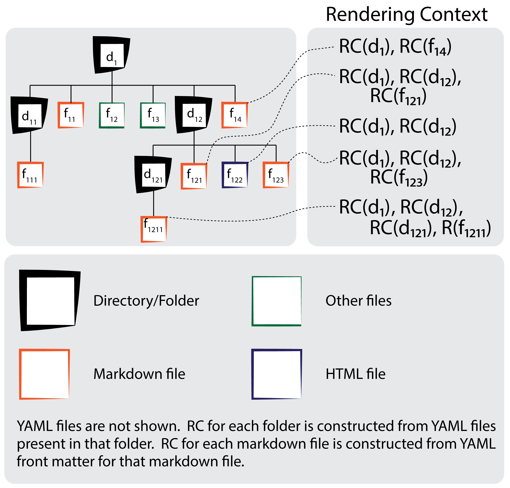
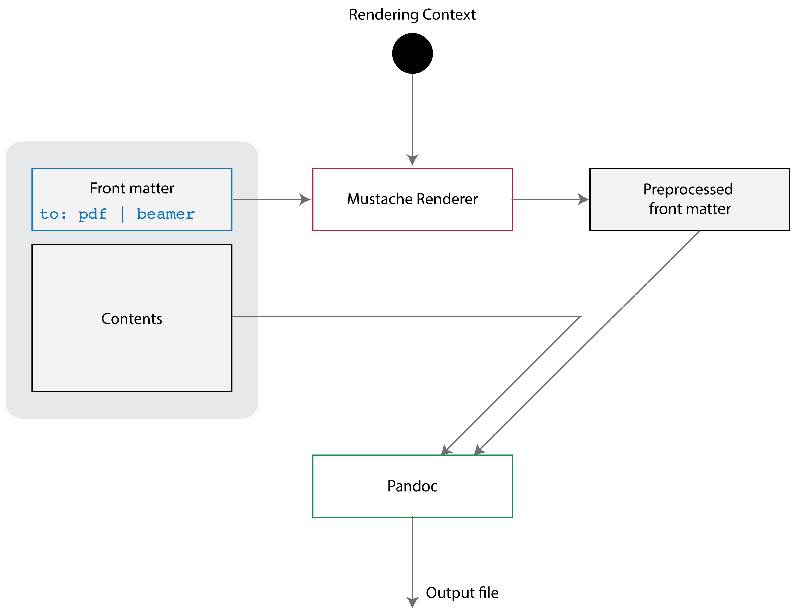
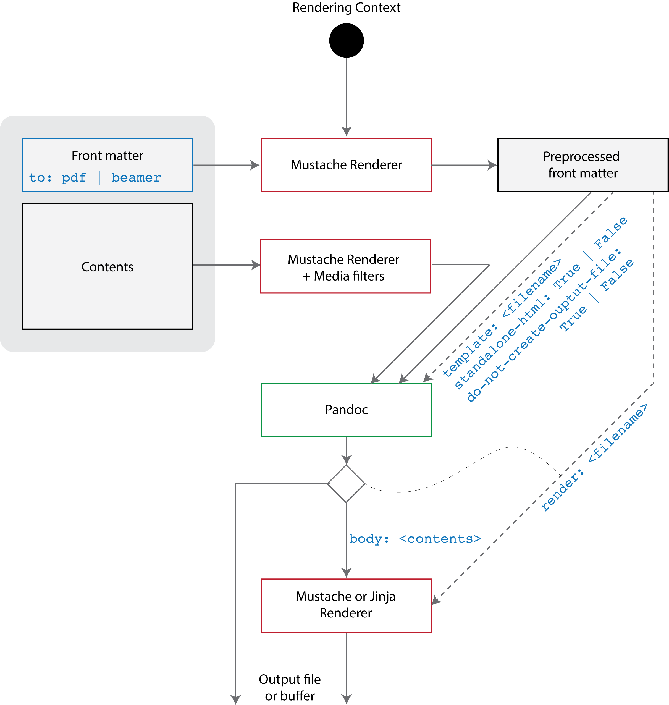

First, some history.  Back in 2017 I was getting increasingly frustrated with using Microsoft PowerPoint and Apple Keynote for creating my course slides.  While both are excellent presentation softwares, with extensive multimedia capabilities, neither supported including 1) code listings with automatic syntax highlighting and 2) LaTeX mathematical notations.  I was able to get around these shortcomings by relying upon custom scripts and third-party tools, such as LaTeXIt.  It was tedious, and I was searching for a tool that would allow me to create static course content for programming and math-oriented courses.

I was aware of the LaTeX ecosystem for creating technical documentation.  I have been using LaTeX for many years, and my graduate students have used Beamer before for creating presentations.  LaTeX and Beamer looked promising for creating course content for my courses.  As I was pondering moving over to the LaTeX ecosystem for creating course content, I stumbled upon markdown and pandoc. 

- [Markdown](http://johnmacfarlane.net) is a lightweight text markup language, which can be used to specify simple formatting instructions.  A number of markdown extensions also support mathematical notations using LaTeX and code blocks.  

- [Pandoc](https://pandoc.org/index.html) is a document conversion utility written by [John MacFarlane](http://johnmacfarlane.net).  Pandoc supports conversion between a wide variety of markdown languages.  Most importantly for me, pandoc can convert markdown documents to HTML and PDF.  Pandoc uses a number of typesetting engines, including pdflatex, xelatex, and lualatex, to convert markdown documents into PDF, and pandoc is able to create both LaTeX-type articles and beamer-style presentations from markdown documents.  In addition, pandoc supports markdown code-listing and LaTeX mathematical notation extensions.

I decided to go with markdown+pandoc combination.  From henceforth I will develop my course content in markdown, and I would use pandoc to convert my notes into the desired format (html, LaTeX articles, or a beamer slides).  This combination, I felt, met my requirement of using plain text to create course content.

# Webify Python Utility

This led me to develop `webify`.  A python utility to create blog aware, static websites from plain text.  Webify "duplicates" each file found in the source directory at the destination directory according to the following three rules:

- A markdown file is converted to the desired format using pandoc utility.  Currently, webify supports markdown-to-html, markdown-to-LaTeX-article (pdf), and beamer-slideshow (pdf) conversions.  When markdown file is converted to html, the process also allows for the possibility of consuming markdown contents within a [mustache](https://mustache.github.io) or [jinja](https://jinja.palletsprojects.com/en/2.11.x/) template.

- An html file is processed using mustache or jinja templating engines.

- All other files are copied as is.

Information stored in yaml files is available as the rendering context (for mustache or jinja renderers).  The rendering context for each markdown file is constructed usiing information found in:

- [A] Yaml files in ancestor folders (up to the root directory); and
- [C] Yaml files in the current folder; and
- [F] Yaml front matter found in the current file.

In case of key collisions, the following preference ordering is used: A < C < F.  The following figure illustrates how rendering context is constructed for each file.



Webify is similar to [Jekyll](https://jekyllrb.com) in many respects.  However, there is a key difference.  Webify supports plaintext to LaTeX articles and Beamer slideshow conversion.  I did not find a straightforward way to accomplish this when I played around with Jekyll.  To be fair, webify doesn't provide a *liveview* option that is available in jekyll.  In addition, webify currently has a rather basic support for blogging.

## The rendering context

Consider the following scenario.

```
example1
├── a
│   ├── a.md
│   └── a.yaml
└── main.yaml
```

The rendering context for file `a.md` will include information from both `main.yaml` and `a.yaml` files, in addition to the information stored in its yaml front matter.  Say the contents of `main.yaml` are:

```
---
title: Webify test site
name: Winnie
```

and the contents of `a.yaml` file are:

```
---
name: Tigger
author: Bugs bunny
keyword: tigger
```

and the contents of `a.md` file are:

```
---
keyword: stuff
---
Important stuff.
```

then the rendering context for `a.md` will be:

```
title: Webify test site
name: Tigger
author: Bugs bunny
keyword: stuff
```

### Global rendering context

Webify adds the following entries to the top-level rendering context.

```txt
__root__: <source directory>
__version__: <version information>
```

## The `_partials` folder

Any folder can contain a special sub-folder, called `_partials`.  Each time webify processes a folder, it first looks whether or not the folder contains a sub-folder, called `_partials`.  If a `_partials` sub-folder is found, then items within this folder are processed.  Items within the `_partials` sub-folder are available added to the rendering context for its parent folder.  This allows a mechanism to create common web-snippets, such as headers, footers, and navigation items, that can be used in any file that is stored in this (the parent) folder or one of its sub-folders.

Consider the following situation.

```
example2
├── _partials
│   ├── footer.html
│   ├── header.html
│   ├── nav.md
│   └── nav.yaml
└── index.md
```

Here, the rendering context for `index.md` file includes the entries, `footer_html`, `header_html`, and `nav_md`.  Each of these entries correspond to the processed `footer.html`, `header.html`, and `nav.md` file contents.

### `.webifyignore` for ignoring files and folders

File `.webifyignore` serves a similar purpose to `.gitignore`.  Files or folder added to `.webifyignore` file are ignored by webify utility.  An example `.webifyignore` is provided below.

```
_templates
*~
.*
.git
.gitignore
.DS_Store
\#*
.pynb_checkpoints
```

## Copying source markdown files to the destination

Webify's default behavior is to process markdown files to create 1) LaTeX articles, 2) beamer slides, or 3) html pages.  This means that webify does not copy the source markdown file to the destination.  E.g., a markdown files `example.md` will be appear as either `example.pdf` (cases 1 and 2) or `example.html` (case 3) at the destination location.  Sometimes however it is desireable to copy the source markdown file to the destination location.  This can be achieved by using the `copy-source` flag in the yaml front matter as follows.

```txt
---
copy-source: True

---
File contents ...
```

The [markdown source](lorem-html.md) for this [html](lorem-html.html) file was copied using this mechanism.  Without this flag, `lorem-html.md` will not be available in the desitnation folder.

## Ignoring markdown files

Use to `ignore` key to force webify to ignore a markdown file during website generation.  The same effect can be achieved by adding this file to the `.webifyignore` file.

```txt
---
ignore: True

---
File contents ...
```

Webify will not process the above file.  The default value for `ignore` is `False`.

## YAML front matter: pandoc filtering

It is possible to apply text filters to data loaded from yaml files.  One common filter is pandoc, which uses pandoc utility to convert markdown text to html text.  This yaml file

```
item1: "_pandoc_ This is [cbc](http://www.cbc.ca)."
item2: "This is [bbc](http://www.bbc.co.uk)."
```

constructs the following rendering context

```
item1: "This is <a href="http://www.cbc.ca">cbc</a>."
item2: "This is [bbc](http://www.bbc.co.uk)."
```

The `_pandoc_` tag is used to invoke pandoc filter on a particular data item.

## YAML front matter: mustache preprocessing

It is possible to process yaml front matter via mustache renderer before adding it to the rendering context for the current file.  The rendering context when processing front matter is constructed from information stored in yaml files present in the current folder and in ancestor folders (up to the root folder).

Consider the following file.

```
---
template: {{__root__}}/_templates/web.html

---
This is a markdown file.
```

If rendering context contains the following:

```
__root__: /Users/foo/web
```

Then after mustache pre-processing this file would become:

```
---
template: /Users/foo/web/_templates/web.html

---
This is a markdown file.
```

A typical use of mustache preprocessing is to specify site-wide template or render files.  This can be achieved by specifying the paths of these files with respect to the root folder of the site. 

Use the `preprocess-frontmatter` to control this behavior.  The default value for this key is `True`.

## Markdown file contents: mustache preprocessing

During markdown-to-html conversion, it is also possible to preprocess buffer contents using mustache.  Consider file `letter.md` below:

```txt
Dear {{name}}:

Please check out webify [here](https://github.com/faisalqureshi/webify).

Regards.
```

If the rendering context contains 

```txt
name: John
```

then the file contents will become

```txt
Dear John:

Please check out webify [here](https://github.com/faisalqureshi/webify).

Regards.
```

The preprocessed contents can be passed to pandoc for conversion to html.

Use the `preprocess-buffer` to control this behavior.  The default value for this key for markdown-to-html conversion is `True`.

## Blogging

Webify version > 3.1 supports blogging.  When blogging is enabled for a folder, all markdown files in this folder and all its descended sub-folders are collected and added to a blogging rendering context.  A special blog index markdown file is processed last, and the blogging rendering context is available to create a blog index.

Consider the following yaml file that sits in folder `blog-example`

```txt
---
blog: True
blog_title: Example Blog
blog_index: index.md
```

This file indicates that folder `blog-example` sets up a blog.  It also identifies a markdown file that will serve as the blog index.  All other markdown files in this folder and in all its descendent folders will be posts.  The contents of `index.md` file are:

```python
---
render: "{{__root__}}/_templates/simple_blog.jinja"

---

```

In this case the `index.md` file simply identifies the jinja template shown below:

```jinja2
<!DOCTYPE html>
<html lang="en">
  <head>
  </head>
  <body>
    <div class="container">
        <h1>{{ blog_title }}</h1>

        <h2>Posts</h2>

        <ul>
            
                <li><a href="{{ post.link }}">{{ post.title }}</a></li>
            
        </ul>

    </div>
  </body>
</html>
```

Webify will process markdown files in folder `blog-example` and all its descendent folders and set up the rendering context that can be used when generating blog index as shown above.  Check [here](blog-example/index.html) for an example blog.

## MDFile Python Utility

Webify uses mdfile python utility to convert markdown files to the desired output format: html pages, LaTeX articles, or beamer slides.  MDfile is built around pandoc and uses pypandoc package to perform markdown conversion.  For markdown-to-HTML conversion, mdfile utility supports mustache and jinja rendering.  Specifically, HTML contents from the pandoc conversion step are processed via mustache or jinja templating engine.  Mustache and jinja rendering has access to this file's rendering context (see Figure 1).

### Markdown to LaTeX articles or Beamer slides

The following figure provides an overview of markdown to LaTeX article or Beamer slides conversion.



The following *keys* are supported during markdown to LaTeX or Beamer slides conversion.  These *keys* controls how pandoc is used to convert the markdown file.

#### YAML front matter

```yaml
pdf-engine:              lualatex | *pdflatex
preprocess-frontmatter:  *True | False
preprocess-buffer:       *False
create-output-file:      *True
ignore:                  *False | True
template:                *None | <pandoc-template>
highlight-style:         kate | *pygments
slide-level:             *1 | 2
include-in-header:       *None | <filename(s)>
include-before-body:     *None | <filename(s)>
include-after-body:      *None | <filename(s)>
bib:                     *None | <bibtex files(s)>
csl:                     *None | <csl file>
```

- `*` next to a value indicates the default value.
- If `template` is not provided, default pandoc template is used.   Use `pandoc -D *FORMAT*` to see the default template.
- `slide-level` is only available when converting markdown to beamer slide.
- If `pdf-engine` isn't specified, pandoc uses the default LaTeX distribution.
- `create-output-file` must be `True`.
- `preprocess-buffer` must be `False`.
- Yaml front matter is only preprocessed via mustache if `preprocess-frontmatter` is `True`.
- `include-in-header`, `include-before-body`, and `include-after-body` can be used to specify files whose contents will be inserted as the name suggests: in the header (before `\begin{document}`), in the body (after `\begin{document}` but before everything else), and just before `\end{document}`.  In each case, multiple files can be specified.
- `bib`: specifies the bibliography file(s).
- `csl`: specifies a [Citation Style Language](https://citationstyles.org) file that control how citations are processed.

#### Example

- [LaTeX article](lorem-article.pdf) ([Source](lorem-article.md))
- [Beamer slides](lorem-slides.pdf) ([Source](lorem-slides.md))

### Markdown to HTML

The following figure provides an overview of markdown to HTML conversion.



#### YAML front matter

```yaml
preprocess-frontmatter:  *True | False
preprocess-buffer:       *True | False
create-output-file:      *True | False
ignore:                  *False | True
template:                *None | <pandoc-template>
highlight-style:         kate | *pygments
include-in-header:       *None | <filename(s)>
include-before-body:     *None | <filename(s)>
include-after-body:      *None | <filename(s)>
css:                     *None | <CSS file(s)>
html-img:                *None | <filename>
html-imgs:               *None | <filename>
html-vid:                *None | <filename>
html-vids:               *None | <filename>
```

- `*` next to a value indicates the default value.
- If `template` is not provided, default pandoc template is used.   Use `pandoc -D html5` to see the default templatze.
- If `create-output-file` is `False`, markdown contents are saved to a buffer.  This functionality is used in `webify` during `_partials` folder processing. 
- Yaml front matter is only preprocessed via mustache if `preprocess-frontmatter` is `True`.
- Media filters tags `html-img`, `html-imgs`, `html-vid` and `html-vids` specify mustache templates to override the default conversion of markdown media tag ``.  See below for more details.
- File contents can be preprocessed via mustache if `preprocess-buffer` is `True`.  This is done before the contents are sent to pandoc for conversion.
- `include-in-header`, `include-before-body`, and `include-after-body` can be used to specify files whose contents will be inserted as the name suggests: in the header (between `<head>` and `</head>`), in the body (after `<body>` tag but before everything else), and just after `</body>`.  In each case, multiple files can be specified.
- `css`: specifies the CSS file(s).

#### Example

- [Generated HTML](lorem-html.html) ([Source](lorem-html.md))

# Installation and Usage

## Mac OSX

1. Install [MacTeX](https://www.tug.org/mactex/)
2. Install [Pandoc](https://pandoc.org/installing.html)
3. Optionally install pandoc's cite-proc citation parser
4. Get [Webify](https://github.com/faisalqureshi/webify)
5. Setup Python.  The current version of webify uses Python > 3.0.  Run `pip -r install webify/webify/requirements.txt` to set up Python.  Optionally you can use `venv` to create a standalone webify Python environemnt.  See [here](https://docs.python.org/3/library/venv.html) for more details.
6. Add webify/webify directory to PATH environment variable.  This folder contains two scripts `mdfile` and `webify`.  Use these scripts to run the utilities.

## Windows

1. Install [MicTeX](https://miktex.org/)
2. Install [Pandoc](https://pandoc.org/installing.html)
3. Optionally install pandoc's cite-proc citation parser
4. Get [Webify](https://github.com/faisalqureshi/webify)
5. Setup Python.  The current version of webify uses Python > 3.0.  Run `pip -r install webify/webify/requirements.txt` to set up Python.  *Use your preferred method for setting up windows python environment.  We also have had some success with using docker containers.*
6. Add webify/webify directory to PATH environment variable.  This folder contains two scripts `mdfile.bat` and `webify.bat`.  Use these scripts to run the utilities.

## Linux

1. `sudo apt-get install texlive-full`
2. `sudo apt-get install pandoc`
3. Get [Webify](https://github.com/faisalqureshi/webify)
4. Setup Python.  The current version of webify uses Python > 3.0.  Run `pip -r install webify/webify/requirements.txt` to set up Python.  Optionally you can use `venv` to create a standalone webify Python environemnt.  See [here](https://docs.python.org/3/library/venv.html) for more details.
5. Add webify/webify directory to PATH environment variable.  This folder contains two scripts `mdfile` and `webify`.  Use these scripts to run the utilities.

## Usage

Check `python mdfile2.py --help` and `python webify2.py --help` for usage and available command line options.

# Copyright

Faisal Qureshi    
Associate Professor Computer Science     
Faculty of Science     
Ontario Tech University     
Oshawa ON L1C OG5     
Web: http://faculty.uoit.ca/qureshi    


